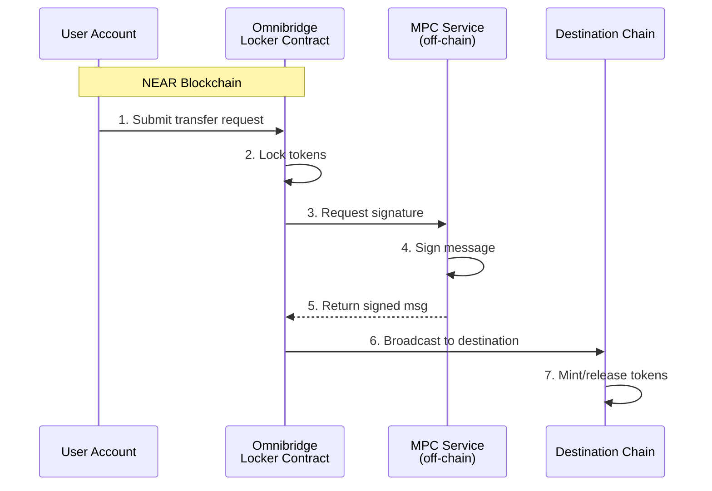

The [Omnibridge](https://github.com/Near-One/omni-bridge) is a multi-chain asset bridge that facilitates secure and efficient asset transfers between different blockchain networks. It solves key challenges in cross-chain communication by leveraging [Chain Signatures](/chain-abstraction/chain-signatures) and its decentralized [Multi-Party Computation (MPC) service](/chain-abstraction/chain-signatures#multi-party-computation-service) to enable trustless cross-chain asset transfers.

## Supported Chains

Omnibridge launches with a hybrid architecture, utilizing different verification methods based on chain-specific requirements and technical constraints. This approach allows support for multiple chains from day one while progressively transitioning to full Chain Signatures integration.

<CardGroup cols={2}>
  <Card title="Ethereum" icon="ethereum">
    Light client + Chain Signatures
  </Card>
  <Card title="Bitcoin" icon="bitcoin">
    Light client + Chain Signatures
  </Card>
  <Card title="Solana" icon="s">
    Wormhole + Chain Signatures
  </Card>
  <Card title="Base" icon="b">
    Wormhole + Chain Signatures
  </Card>
  <Card title="BNB Chain" icon="coins">
    Wormhole + Chain Signatures
  </Card>
  <Card title="Arbitrum" icon="a">
    Wormhole + Chain Signatures
  </Card>
</CardGroup>

## How Omnibridge Works

Omnibridge introduces an elegant solution using Chain Signatures. Instead of running light clients on each destination chain, it leverages Chain Signature's MPC Service to enable secure cross-chain message verification without the overhead of traditional light client verification.

<Tip>
  This approach reduces verification times from hours to minutes while significantly reducing gas costs across all supported chains.
</Tip>

### The Problem with Traditional Bridges

A light client is a smart contract that lets one blockchain verify events happening on another blockchain. Traditional bridges like Rainbow Bridge require:

- Storing extensive block data (e.g., two weeks of Ethereum blocks)
- Maintaining updated validator lists and stakes
- Verifying signatures (e.g., ED25519) that weren't designed for the target chain
- High gas costs and slow transaction times (4-8 hours for NEAR to Ethereum)

<Warning>
  Some chains, such as Bitcoin, don't even support smart contracts, making it technically impossible to implement a traditional light client approach.
</Warning>

### Chain Signatures Solution

Instead of maintaining complex light clients on destination chains, Chain Signatures introduces a fundamentally different approach based on three core components:

<Steps>
  <Step title="Deterministic Address Derivation">
    Every NEAR account can mathematically derive addresses on other chains through derivation paths. This ensures the same NEAR account always controls the same set of addresses across all supported chains.
  </Step>
  <Step title="Bridge Smart Contract">
    A central contract on NEAR coordinates with the MPC network to generate secure signatures for cross-chain transactions. This contract handles token locking and requests signatures for outbound transfers.
  </Step>
  <Step title="MPC Service">
    A decentralized network of nodes that jointly sign transactions without ever reconstructing a full private key. Security comes from threshold cryptography - no single node or small group can create valid signatures alone.
  </Step>
</Steps>

## Transfer Flow

Here's how transfers are processed from NEAR to other chains:



### Transfer Lifecycle

<Steps>
  <Step title="Initiation">
    User calls the token contract with:
    - Amount to transfer
    - Destination chain and address
    - Fee preferences (pay in token or NEAR)
  </Step>
  <Step title="Token Lock/Burn">
    For native NEAR tokens: locked in bridge contract
    
    For bridged tokens: burned
  </Step>
  <Step title="MPC Signing">
    Bridge contract requests signature generation. MPC nodes jointly generate and aggregate the signature while maintaining threshold security.
  </Step>
  <Step title="Destination Chain Execution">
    Bridge Token Factory on destination chain verifies the MPC signature and mints equivalent tokens.
  </Step>
</Steps>

## Token Standards and NEP-141

NEAR's [NEP-141](https://github.com/near/NEPs/tree/master/neps/nep-0141.md) fungible token standard has built-in composability through transfer-and-call functionality that sets it apart from Ethereum's ERC-20.

When a token transfer happens using `ft_transfer_call`, the token contract:

1. First transfers the tokens
2. Automatically calls the specified `ft_on_transfer` method on the receiver contract
3. The receiver contract can reject the transfer, causing tokens to be refunded

<Info>
  This atomic behavior ensures the integrity and safety of bridge operations by preventing partial execution states.
</Info>

## Bridge Token Factory Pattern

At the core of Omnibridge is the Bridge Token Factory contract on NEAR that serves as both a token factory and custodian.

### For Bridged Tokens (from other chains)

- Deploys new token contracts when bridging tokens for the first time
- Mints tokens when receiving valid transfer messages
- Burns tokens when initiating transfers back to the origin chain

### For Native NEAR Tokens

- Acts as custodian by locking tokens during transfers
- Releases tokens when receiving valid transfer messages
- Manages token operations through the NEP-141 standard

## Return Flow: Other Chains to NEAR

The reverse flow varies based on the source chain:

<Tabs>
  <Tab title="Ethereum">
    Uses NEAR light client for maximum security:
    
    1. Burn tokens on Ethereum
    2. Submit proof to NEAR
    3. Verify proof through light client
    4. Release tokens to recipient
  </Tab>
  <Tab title="Solana & EVM Chains">
    Utilize established message passing protocols (such as Wormhole) for:
    
    - Message passing between chains
    - Transaction verification
    - Integration with NEAR token factory system
  </Tab>
  <Tab title="Bitcoin">
    Uses Bitcoin light client on NEAR:
    
    1. Lock BTC on Bitcoin
    2. Submit proof to NEAR
    3. Verify proof through light client
    4. Mint bridged BTC on NEAR
  </Tab>
</Tabs>

## Chain-to-Chain Transfers (via NEAR)

For transfers between two non-NEAR chains (e.g., Ethereum to Solana), the bridge uses NEAR as an intermediary routing layer.

<Note>
  From the user's perspective, this appears as a single operation. The off-chain relayer infrastructure handles the intermediate NEAR routing automatically.
</Note>

## Security Model

Omnibridge requires different trust assumptions depending on the chain connection:

<AccordionGroup>
  <Accordion title="Chain Signatures Security">
    - NEAR Protocol security (2/3+ honest validators)
    - MPC network security (2/3+ honest nodes)
    - No single entity controls enough MPC nodes to forge signatures
    - Correct implementation of the signing protocol
  </Accordion>

  <Accordion title="Light Client Security">
    - Light client correctness and security
    - Finality assumptions (sufficient block confirmations)
    - Chain-specific consensus assumptions
  </Accordion>

  <Accordion title="Message Passing Security">
    - Security of the underlying protocol (e.g., Wormhole Guardian network)
    - Verification by NEAR network participants (validators and full nodes)
  </Accordion>
</AccordionGroup>

## Relayer Network

Relayers are permissionless infrastructure operators who monitor for bridge events and execute cross-chain transactions.

<CardGroup cols={2}>
  <Card title="What Relayers CAN'T Do" icon="xmark">
    - Forge transfers
    - Steal funds
    - Censor transactions
    - Front-run for profit
    - Create security assumptions
  </Card>
  <Card title="What Relayers DO" icon="check">
    - Execute valid transfers
    - Collect predetermined fees
    - Provide operational infrastructure
    - Compete for faster execution
  </Card>
</CardGroup>

<Info>
  Multiple relayers can operate simultaneously, creating competition for faster execution and lower fees. Users can also self-relay to bypass relayer fees entirely.
</Info>

## Fast Transfers

Standard cross-chain transfers can take time due to finality and verification requirements. **Fast Transfers** allow relayers to expedite this process by fronting liquidity.

<Steps>
  <Step title="User Initiation">
    User sends a `FastFinTransferMsg` specifying the destination and fee.
  </Step>
  <Step title="Relayer Execution">
    Relayer detects the request and instantly transfers the equivalent amount (minus fees) to the user on the destination chain from their own funds.
  </Step>
  <Step title="Settlement">
    The bridge later reimburses the relayer once the original transfer is fully verified and finalized.
  </Step>
</Steps>

<Tip>
  Fast transfers are ideal for users who prioritize speed over cost, as relayers may charge a premium for the liquidity and convenience.
</Tip>

## Fee Structure

Bridge fees are unified and processed on NEAR, with components including:

- Destination chain gas costs
- Source chain storage costs
- Relayer operational costs
- MPC signing costs

### Fee Payment Options

- Native tokens of source chain
- The token being transferred

<Note>
  Fees dynamically adjust based on gas prices across different chains to ensure reliable execution.
</Note>

## Multi-Token Support (ERC1155)

Omnibridge supports the **ERC1155** standard, enabling the transfer of multiple token types within a single contract.

### Address Derivation

To maintain consistency across chains, bridged ERC1155 tokens use a deterministic address derivation scheme:

```
Deterministic Address = keccak256(tokenAddress + tokenId)
```

This ensures that each `tokenId` within an ERC1155 contract maps to a unique, consistent address on the destination chain.

## Resources

<CardGroup cols={3}>
  <Card title="Omnibridge Repository" icon="github" href="https://github.com/Near-One/omni-bridge">
    Main codebase and documentation
  </Card>
  <Card title="JavaScript SDK" icon="js" href="https://github.com/Near-One/bridge-sdk-js">
    SDK for JavaScript/TypeScript integration
  </Card>
  <Card title="Rust SDK" icon="rust" href="https://github.com/Near-One/bridge-sdk-rs">
    SDK for Rust integration
  </Card>
</CardGroup>

## Next Steps

<CardGroup cols={2}>
  <Card title="Implementation Details" icon="code" href="/chain-abstraction/omnibridge/implementation">
    Explore technical architecture and code examples
  </Card>
  <Card title="Development Roadmap" icon="map" href="/chain-abstraction/omnibridge/roadmap">
    Learn about upcoming features and improvements
  </Card>
</CardGroup>
